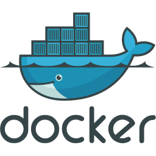
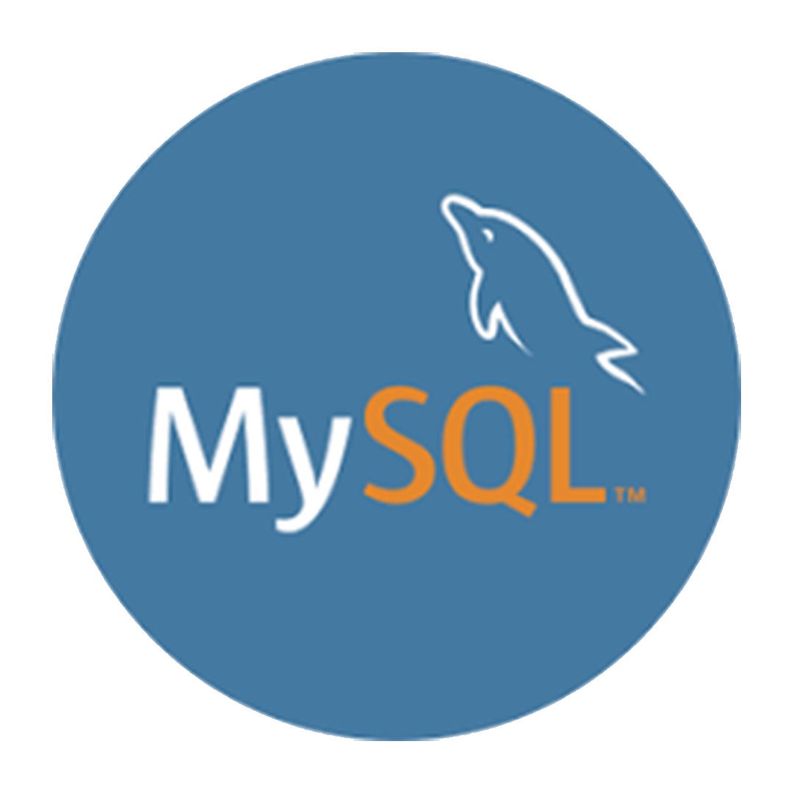

# Spring-Papelaria
## Sumário abaixo:
**É apresentado todo conteúdo que será apresentado desenvolvido**
>Nesse repositório tem como objetivo demonstrar uma aplicação de Sringboot com container e banco de dados para uma papelaria onde tem cadastro de Cliente,Produto e Pedido. Utilizando usando as ferramentas Docker, Spring tool, Mysql e Postman.

# Sumário:
## Conteúdo 
+ Ferramentas
    + Docker
    + Eclipse 
    + MySQL Workbench
    + Postman
    + Springboot
+ Eclipse
    + Criando o projeto Spring
        + Criando a camada Domain
        + Criando a camada Repository
        + Criando a camada Controller
        + Configurando application.properties 
        + Criando o Dockerfile e configurando porm.xml 

---

## • Docker
> Docker é uma plataforma de software que permite criar, gerenciar e executar aplicativos em contêineres. Um contêiner é uma unidade de software que empacota código e suas dependências, permitindo que ele seja executado de maneira consistente e portátil em diferentes ambientes, como sistemas operacionais e nuvens.

<br>
<br>
<div align="center">
    <a href="https://github.com/Isack2022/Estudo-Dokcer">
        
    </a>
</div >
<br>


---
## • Eclipse
> O Eclipse é um ambiente de desenvolvimento integrado IDE de código aberto amplamente utilizado para a criação de software. Ele fornece um conjunto de ferramentas e recursos para facilitar o desenvolvimento de aplicativos em várias linguagens de programação.

<br>
<br>
<div align="center">
    <a href="https://www.eclipse.org/downloads/packages/release/2023-03/r/eclipse-ide-java-developers">
        
    </a>
</div >
<br>

---
## • Mysql Workbench 
>O MySQL Workbench é uma ferramenta visual de modelagem de dados, desenvolvimento e administração de banco de dados MySQL. Ela fornece uma interface gráfica para facilitar a criação, gerenciamento e manutenção de bancos de dados MySQL.

<br>
<br>
<div align="center">
    <a href="https://dev.mysql.com/downloads/workbench/">
        
    </a>
</div >
<br>

---

## • Postaman
> O Postman é uma ferramenta popular de colaboração e desenvolvimento de API. Ele oferece uma interface gráfica amigável que permite aos desenvolvedores criar, testar, documentar e compartilhar solicitações de API de forma eficiente.

<br>
<br>
<div align="center">
    <a href="https://www.postman.com/downloads/">
        
    </a>
</div >

--- 

## • Spring-Boot
> O Spring Boot é um framework de desenvolvimento de aplicativos Java que visa simplificar a criação e configuração de aplicativos baseados no ecossistema do Spring. Ele fornece um conjunto de recursos e convenções para agilizar o processo de configuração e desenvolvimento, permitindo que os desenvolvedores foquem na lógica de negócios de seus aplicativos.

<br>
<br>
<div align="center">
    <a href="https://spring.io/tools">
        
    </a>
</div >
<br>

--- 

## Criando o projeto Spring
Com as ferramentas instaladas, criaremos o projeto Spring chamando Papelaria sob as seguintes condições: uma camada para o acesso, a categoria, o Cliente, o Pedido, os Itens Pedidos e o Produto.

---
### Criando a camada Domain:
Com o projeto criando iremos criar as classes chamadas [Categoria](src/main/java/br/com/projeto/domain/Categoria.java),[Cliente](src/main/java/br/com/projeto/domain/Cliente.java.java),[Itens Pedido](src/main/java/br/com/projeto/domain/ItensPedido.java.java),[Pedido](src/main/java/br/com/projeto/domain/Pedido.java.java),[Produto](src/main/java/br/com/projeto/domain/Produto.java) e [Usuário](src/main/java/br/com/projeto/domain/Categoria.java). Visando ser uma tabelas semelhantes a do banco de dados. Veja abaixo o script da classe Categoria:
```
package br.com.projeto.domain;

import java.sql.Date;

import jakarta.persistence.Column;
import jakarta.persistence.Entity;
import jakarta.persistence.GeneratedValue;
import jakarta.persistence.GenerationType;
import jakarta.persistence.Id;

@Entity
public class Categoria {
	
	@Id
	@GeneratedValue(strategy=GenerationType.IDENTITY)
	@Column(nullable = false)
	private Integer idcategoria;
	
	@Column(nullable = false)
	private String nomecategoria;
	
	@Column(nullable = false)
	private Date datacriacao;

	public Categoria() {
	}

	public Categoria(Integer idcategoria, String nomecategoria, Date datacriacao) {
		super();
		this.idcategoria = idcategoria;
		this.nomecategoria = nomecategoria;
		this.datacriacao = datacriacao;
	}

	public Integer getIdcategoria() {
		return idcategoria;
	}

	public void setIdcategoria(Integer idcategoria) {
		this.idcategoria = idcategoria;
	}

	public String getNomecategoria() {
		return nomecategoria;
	}

	public void setNomecategoria(String nomecategoria) {
		this.nomecategoria = nomecategoria;
	}

	public Date getDatacriacao() {
		return datacriacao;
	}

	public void setDatacriacao(Date datacriacao) {
		this.datacriacao = datacriacao;
	}
}
```

---

## Criando a camada Repository
Depois vem o arquivo interface da camada repository com o nome do domain+Repository, que é um padrão de projeto que visa mediar a pesquisa de objetos de domínio entre a camada de domínio e a camada de mapeamento de dados usando uma interface semelhante à de uma coleção. Veja o script abaixo de CategoriaRepository:
```
package br.com.projeto.repository;

import org.springframework.data.jpa.repository.JpaRepository;

import br.com.projeto.domain.Categoria;

public interface CategoriaRepository extends JpaRepository<Categoria, Integer>{

}
```

--- 

## Criando a camada Controller
Agora na camada controller, criaremos a ultima classe com o nome da Classe+Controller, que é lida com as requisições dos usuários. É responsável por retornar uma resposta e cadastrar no banco de dados com a ajuda das camadas Model e View. Veja o script abaixo de CategoriaController:

```
package br.com.projeto.controller;

import java.util.List;

import org.springframework.beans.factory.annotation.Autowired;
import org.springframework.web.bind.annotation.GetMapping;
import org.springframework.web.bind.annotation.PostMapping;
import org.springframework.web.bind.annotation.RequestBody;
import org.springframework.web.bind.annotation.RestController;

import br.com.projeto.domain.Categoria;
import br.com.projeto.repository.CategoriaRepository;

@RestController
public class CategoriaController {
	
	@Autowired
	private CategoriaRepository ca;
	
	@GetMapping("/categoria/listar")
	public List <Categoria> listar(){
		return ca.findAll();
	}
	
	@PostMapping("/categoria/cadastrar")
	public String cadastrar(@RequestBody Categoria cat) {
		String msg ="";
		ca.save(cat);
		msg = "Cadastrou";
		return msg;
	}
}
```
---
### Configurando application.properties
Neste arquivo será configurado a conexão do Banco de dados através do ip do MySQL e a porta do servidor spring, veja abaixo:
```
spring.datasource.url=jdbc:mysql://172.18.0.2:3306/papelariadb?usessl=false
spring.datasource.username=root
spring.datasource.password=senac@123
spring.jpa.properties.hibernate.dialect=org.hibernate.dialect.MySQL8Dialect
spring.jpa.hibernate.ddl-auto=update

#porta do servidor spring
server.port=8091

```

---
###  Criando o Dockerfile e configurando porm.xml 

Criaremos o arquivo chamado [Dockerfile](Dockerfile) com o script abaixo:  
```
FROM openjdk:17
EXPOSE 8091
ADD target/app-papelaria.jar app-papelaria.jar
ENTRYPOINT ["java","-jar","app-papelaria.jar"]
```
Após criar o arquivo Dockerfile abra o arquivo pom.xml e nas últimas linhas adicione o seguinte comando:
 ```
 <finalName>Papelaria</finalName> 
 ```